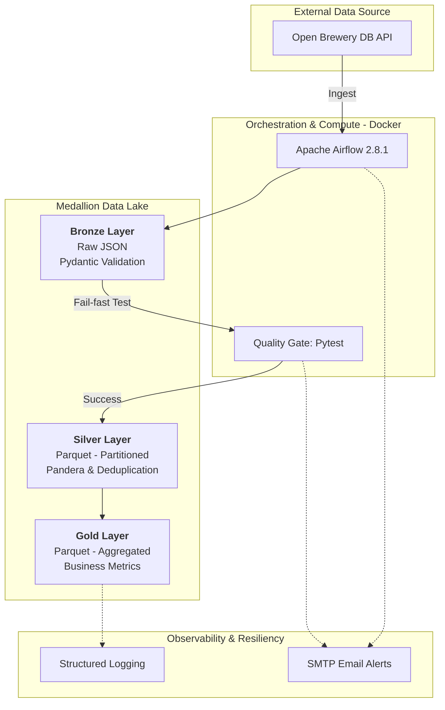

# 🍻 Brewery Data Pipeline - AB InBev Technical Case


    
This repository contains a robust, scalable data engineering solution for ingesting, transforming, and aggregating data from the **Open Brewery DB API**. The solution follows the **Medallion Architecture** and is orchestrated by **Apache Airflow** within a fully containerized environment.

## 🏗️ Architecture Overview
The pipeline is structured into three logical layers to ensure data lineage, auditing, and high-quality analytics:

* **Bronze (Raw):**
    1. Data Fidelity: Ingests raw JSON data directly from the API, serving as a "Source of Truth".

    2. Contract Compliance: Every record is validated against the official Open Brewery DB API schema using Pydantic, ensuring structural integrity from the moment of capture.

    3. Immutability: Focuses on a "Schema-on-read" approach, preserving the raw state of every record for auditing and lineage purposes.

    4. Early Detection: Implementation of proactive monitoring for encoding issues (e.g., U+FFFD) and structural violations directly at the ingestion stage.
* **Silver (Cleansed & Standardized):**

    1. Data Sanitization: Removal of corrupted Unicode characters (mojibake) and string normalization to ensure consistent naming conventions across the dataset.

    2. Schema Enforcement: Rigorous type validation and business rule enforcement using Pandera, ensuring the data strictly adheres to the defined contract.

    3. Deduplication: Guaranteed record uniqueness by implementing logic to identify and drop duplicate entries based on the brewery_id.

    4. Data Scrubbing: Advanced handling of geographical coordinates; instead of dropping rows, the pipeline nullifies invalid Latitude/Longitude values to maintain overall metric volume while ensuring GIS compatibility.

    5. Optimization: Conversion to columnar Parquet format with physical partitioning by Country and State/Province. This significantly reduces I/O costs and improves performance for analytical queries.
* **Gold (Analytics):** Aggregated business-level view, providing brewery counts by type and location, optimized for BI tool consumption and reporting.


---

## 🛠️ Technical Stack & Decisions

* **Orchestration:** **Apache Airflow 2.8.1** (LocalExecutor) for reliable task scheduling and monitoring.
* **Data Processing:** **Pandas** and **PyArrow** for efficient Parquet handling and memory management.
* **Validation & Quality:**
    * **Pydantic:** Structural validation and type hinting during the ingestion phase.
    * **Pandera:** Strict business rule validation (e.g., valid brewery types) and schema enforcement in the Silver layer.
* **DataOps & Testing:** **Pytest** integrated as an **Automated Quality Gate**. The pipeline runs unit tests before moving data to the Silver layer (Fail-fast principle).
* **Infrastructure:** **Docker & Docker Compose** with a focus on security and permission management (`AIRFLOW_UID`).

---

## 🛡️ Data Quality & Resiliency

1.  **Circuit Breaker (Quality Gate):** The `task_validate_logic` runs a suite of unit tests using `pytest`. If the transformation logic or data contract is violated, the pipeline stops immediately, preventing "dirty data" from reaching downstream layers.
2.  **Coordinate Nullification:** Instead of dropping records with corrupt GPS data (Latitude > 90 or Longitude > 180), the pipeline nullifies only the erroneous coordinates. This preserves overall business metrics (volume/count) while ensuring GIS compatibility.
3.  **Observability:** Structured logging throughout the pipeline allows for easy debugging via Airflow logs, with standardized prefixes for each module (e.g., `[Bronze Ingestion]`, `[Silver Transformation]`).
4.  **Idempotency:** The pipeline is designed to be re-run for any period without creating duplicates or corrupting the existing Data Lake.
5. **Upstream Anomaly Handling**: Detects and sanitizes "mojibake" or corrupted Unicode characters (e.g., \ufffd) directly from the source API, ensuring that visualization tools in the Gold layer render clean text for addresses and names.

6. **Alerting & Monitoring:** The pipeline features an automated alerting system via SMTP. In case of task failure, an email notification is immediately dispatched to the administrator.

    * Configuration: All alert settings are managed via environment variables in the .env file (and referenced in docker-compose.yaml), including:

        ```YAML
        AIRFLOW_VAR_SMTP_MAIL_FROM: The sender account.

        AIRFLOW_VAR_SMTP_MAIL_TO: The destination address for alerts.

        AIRFLOW_VAR_SMTP_APP_PASSWORD: Secure App Password for authentication.
        ```

---

## 📂 Project Structure

```text
.
├── dags/            # Airflow DAG definitions
├── src/             # Core logic: Extraction, Transformation, and Schemas
│   ├── utils/       # Shared helpers (file_ops, logging)
├── tests/           # Unit tests suite (Pytest)
├── data/            # Local Data Lake (Bronze/Silver/Gold) - .gitignored
├── docker/          # Dockerfile and environment configs
└── docker-compose.yaml
```

## 🚀 Getting Started

1. **Setup Environment:**
    * Clone the provided example environment file to create your local configuration:

    ```bash
    cp .env.example .env
    ```

    * Ensure your .env file contains your local AIRFLOW_UID (run id -u in your terminal to find it, typically 1000) and your SMTP credentials to enable the automated alerting system.

2. **Launch the Stack:**

```bash
docker-compose up -d --build
```

3. **Access Airflow:** Navigate to localhost:8080 (admin/admin) and trigger the etl_breweries_pipeline.

4. **Manual Testing:** To run the test suite manually within the container environment:

```bash
docker exec -it breweries-airflow-scheduler-1 pytest /opt/airflow/tests
```

## 🔒 Security & Best Practices

* **Secret Management:** All sensitive credentials (SMTP, API keys) are managed through environment variables and protected via `.gitignore`.
* **Permission Handling:** Volume mapping respects host-container UID synchronization (AIRFLOW_UID) to avoid permission issues on Linux systems.
* **Decoupled Logic:** The transformation logic is abstracted from the Airflow Operators, allowing for easier testing and future migration to other compute engines (like Spark).